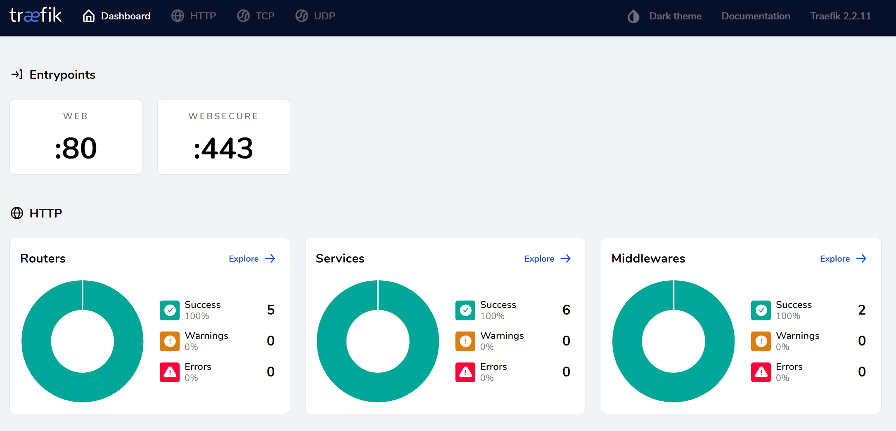

# Traefik Boilerplate Proxy

  

Boilerplate for quick configuration of Docker containers for reverse proxy with [Traefik v2.x](https://github.com/containous/traefik), automatic configuration of virtualhosts and generation of SSL certificates with Let's Encrypt.

## Requirements

* Docker 19.03 or higher
* Docker Compose 1.27 or higher

## Contributing

1. Fork this repository!
2. Create your feature from the **develop** branch: git checkout -b feature/my-new-feature
3. Write and comment your code
4. Commit your changes: `git commit -am 'Add some feature'`
5. Push the branch: `git push origin feature/my-new-feature`
6. Make a pull request to the branch **develop**

## Credits

* [Fábio Assunção](https://github.com/fabioassuncao)
* [All Contributors](../../contributors)

## License

Licensed under the MIT License.